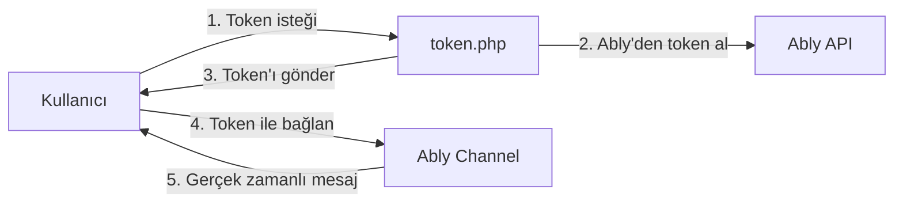

# InfinityFree Chat Widget 🌐

<div align="center">
  
  
  
  <br>
  <strong>🚫 Sunucuda Sıfır Chat Kodu • 🔐 Güvenli Token Auth • 🌍 9 Dil Desteği</strong>
</div>

## 📋 İçindekiler
- [Özellikler](#-özellikler)
- [Nasıl Çalışır?](#-nasıl-çalışır)
- [Kurulum Adımları](#-kurulum-adımları)
- [Yapılandırma](#-yapılandırma)
- [Dil Desteği](#-dil-desteği)
- [Emoji Kullanımı](#-emoji-kullanımı)
- [Güvenlik](#-güvenlik)
- [InfinityFree Uyumluluğu](#-infinityfree-uyumluluğu)
- [Sık Sorulan Sorular](#-sık-sorulan-sorular)
- [Sorun Giderme](#-sorun-giderme)
- [Lisans](#-lisans)

## ✨ Özellikler

### 🚫 **InfinityFree Dostu**
- Sunucuda SADECE token üretimi yapar (chat kodu YOK)
- Veritabanı kullanmaz
- "Chat script" yasağını ihlal etmez

### 🔐 **Güvenli Altyapı**
- API Key sunucuda gizli kalır (token.php'de)
- Her kullanıcıya özel 1 saat geçerli token
- Ably'nin güvenli altyapısı

### 🎨 **Kullanıcı Deneyimi**
- **9 dil desteği** (Dropdown ile seçim)
- **Emoji paneli** (Tek tıkla emoji ekleme)
- **İsim değiştirme** (Kullanıcı dostu arayüz)
- **Aktif kullanıcı sayacı**
- **Sürüklenebilir pencere**
- **Bağlantı durumu göstergesi**

### ⚡ **Performans**
- Hafif ve hızlı
- Gerçek zamanlı mesajlaşma
- Düşük bant genişliği kullanımı

## 🔧 Nasıl Çalışır?



**Önemli**: Sunucu (token.php) SADECE token üretir. Tüm chat iletişimi doğrudan Ably üzerinden gerçekleşir!

## 📦 Kurulum Adımları

### 1. Ably Hesabı Oluşturun

```bash
1. https://ably.com/signup adresine gidin
2. Ücretsiz hesap oluşturun
3. Dashboard'dan "Create New App" → "Chat App" seçin
4. "API Keys" bölümünden "Root Key"i kopyalayın
```

### 2. Token Sunucusunu Kurun (token.php)

```php
<?php
// token.php - InfinityFree Uyumlu Token Üretici
// ⚠️ Bu dosyada HİÇBİR chat kodu yok, SADECE token üretir!

define('ABLY_API_KEY', 'xVIyHw.ArU8jg:j3k2h1g5f6d7s8a9'); // Kendi key'inizle değiştirin
define('ABLY_APP_ID', 'xVIyHw'); // Ably App ID'niz

// Token üretme kodu buraya (yukarıdaki token.php dosyasındaki kodun aynısı)
?>
```

### 3. Widget Dosyasını Yükleyin

```bash
# Dosyaları InfinityFree hosting'inize yükleyin
htdocs/
├── token.php          # SADECE token üretir
└── widget.js          # Ana widget kodu (yukarıdaki güncel kod)
```

### 4. Sitenize Ekleyin

```html
<!-- Tek satır kod ile chat widget'ını ekleyin -->
<script data-name="Chat-Widget"
        data-cfasync="false"
        src="https://siteniz.com/widget.js"
        data-token-server="https://siteniz.com/token.php"
        data-room="genel"
        data-color="#4CAF50"
        data-position="right"
        data-x_margin="18"
        data-y_margin="18"
        data-title="Canlı Sohbet"
        data-language="tr">
</script>
```

## ⚙️ Yapılandırma

### Tüm Parametreler

| Parametre | Açıklama | Zorunlu | Varsayılan | Örnek |
|-----------|----------|---------|------------|-------|
| `data-token-server` | Token sunucusu URL'i | ✅ | - | `https://siteniz.com/token.php` |
| `data-room` | Sohbet odası adı | ❌ | `genel` | `destek`, `oyun` |
| `data-color` | Widget rengi | ❌ | `#FFDD00` | `#4CAF50`, `#FF5722` |
| `data-position` | Konum | ❌ | `right` | `left`, `right` |
| `data-x_margin` | Yatay kenar boşluğu | ❌ | `18` | `10`, `20`, `30` |
| `data-y_margin` | Dikey kenar boşluğu | ❌ | `18` | `10`, `20`, `30` |
| `data-title` | Pencere başlığı | ❌ | `Sohbet` | `Destek`, `Chat` |
| `data-language` | Varsayılan dil | ❌ | `tr` | `en`, `de`, `fr`, `es` |

### Renk Örnekleri

```html
<!-- Popüler renkler -->
data-color="#4CAF50"  <!-- Yeşil -->
data-color="#2196F3"  <!-- Mavi -->
data-color="#9C27B0"  <!-- Mor -->
data-color="#FF5722"  <!-- Turuncu -->
data-color="#E91E63"  <!-- Pembe -->
```

### Farklı Odalar

```html
<!-- Teknik destek odası -->
<script ... data-room="teknik-destek" ...>

<!-- Oyun odası -->
<script ... data-room="oyun-odasi" ...>

<!-- Özel sohbet -->
<script ... data-room="ozel-sohbet" ...>
```

## 🌍 Dil Desteği

Widget, dropdown menüden seçilebilen **9 dil** desteği sunar:

| Dil | Kod | Bayrak |
|-----|-----|--------|
| Türkçe | `tr` | 🇹🇷 |
| English | `en` | 🇬🇧 |
| Deutsch | `de` | 🇩🇪 |
| Français | `fr` | 🇫🇷 |
| Español | `es` | 🇪🇸 |
| العربية | `ar` | 🇸🇦 |
| Русский | `ru` | 🇷🇺 |
| 中文 | `zh` | 🇨🇳 |
| 日本語 | `ja` | 🇯🇵 |

### Dil Seçimi

Kullanıcılar **toolbar'daki dropdown** menüden dili anında değiştirebilir:

```html
<!-- Toolbar'da dil seçici otomatik gelir -->
[🇹🇷 Türkçe] [✏️ İsim Değiştir] [😊 Emoji]
```

## 😊 Emoji Kullanımı

### Hazır Emoji Seti
```javascript
// Widget'da hazır gelen emojiler
['😊', '😂', '❤️', '👍', '🎉', '🔥', '😢', '😍', '🤔', 
 '👏', '🙏', '💯', '⭐', '🌈', '🍕', '🎸', '⚽', '🏀']
```

### Emoji Ekleme
1. **Emoji butonuna tıklayın** (😊 Emoji)
2. **Açılan panelden** istediğiniz emojiyi seçin
3. Emoji otomatik olarak mesaj kutusuna eklenir

## 🔐 Güvenlik

### Neden Güvenli?

1. **API Key Gizli Kalır**
   - Sadece `token.php` içinde
   - İstemci asla API Key'i görmez

2. **Token Tabanlı Auth**
   ```javascript
   // Her kullanıcıya özel token
   {
     "token": "xyz...",
     "expires": 3600000, // 1 saat geçerli
     "capability": "sadece belirli oda için yetki"
   }
   ```

3. **Sunucu Temiz**
   ```php
   // token.php'de chat kodu YOK
   // SADECE HTTP isteği ve token üretimi
   ```

## 🏢 InfinityFree Uyumluluğu

### Neden Çalışır?

✅ **Sunucuda Chat Kodu Yok**
```php
// token.php - SADECE token üretir
// "chat" kelimesi geçmez
// PHP script'lerde chat fonksiyonu yok
```

✅ **Veritabanı Yok**
- Tüm mesajlar Ably'de
- InfinityFree DB kotası kullanılmaz

✅ **Statik Dosyalar**
- widget.js istemci taraflı
- PHP sadece token üretir

### InfinityFree Kurallarına Uygunluk

```bash
# InfinityFree yasaklı içerik kontrolü
❌ PHP chat script'i
❌ Veritabanı chat tablosu
❌ Mesaj loglama

✅ Token üreten PHP (chat yok)
✅ İstemci taraflı JavaScript
✅ Ably altyapısı
```

## ❓ Sık Sorulan Sorular

### S: InfinityFree "chat script" yasağını ihlal ediyor muyum?
**C:** HAYIR! Sunucunuzda SADECE token üreten PHP var. Chat iletişimi tamamen Ably'de.

### S: Kullanıcıların isimleri kalıcı mı?
**C:** Tarayıcıda localStorage'da saklanır. Sayfa yenilense bile aynı isimle gelir.

### S: Mesajlar kaydediliyor mu?
**C:** Hayır, tüm mesajlar geçicidir. Sayfa yenilenince silinir.

### S: Kaç kullanıcı aynı anda sohbet edebilir?
**C:** Ably ücretsiz planında aylık 6 milyon mesaj sınırı var, kullanıcı sınırı YOK.

### S: Mobil uyumlu mu?
**C:** Evet, responsive tasarım. Telefon ve tablette sorunsuz çalışır.

### S: Özel emoji ekleyebilir miyim?
**C:** Evet, widget.js'deki `emojis` dizisini düzenleyerek özel emojiler ekleyebilirsiniz.

## 🚨 Sorun Giderme

### Widget Görünmüyor
```javascript
// Tarayıcı konsolunu açın (F12)
// Hata mesajlarını kontrol edin

// Ably yüklendi mi?
typeof Ably // "function" olmalı

// Token alınabildi mi?
fetch('https://siteniz.com/token.php?client_id=test')
  .then(r => r.json())
  .then(console.log)
```

### Mesajlar Gitmiyor
```bash
1. Ably dashboard'da kota kontrolü
2. Token süresi dolmuş olabilir (1 saat)
3. İnternet bağlantısını kontrol edin
```

### Dil Değişmiyor
```javascript
// Manuel dil değiştirme
document.querySelector('#language-select').value = 'en';
// Event tetikleme
document.querySelector('#language-select').dispatchEvent(new Event('change'));
```

### Bağlantı Sorunları
```javascript
// Bağlantı durumunu kontrol edin
// Yeşil: Bağlı, Kırmızı: Bağlantı yok
const status = document.getElementById('connection-status');
```

## 📝 Lisans

MIT Lisansı - Özgürce kullanın, değiştirin, paylaşın!

```
Copyright (c) 2024 

Permission is hereby granted, free of charge, to any person obtaining a copy
of this software and associated documentation files...
```

## 🤝 Katkıda Bulunma

1. Fork edin
2. Feature branch oluşturun
3. Değişikliklerinizi commit edin
4. Push yapın
5. Pull Request açın

## 📞 Destek

- 💬 **GitHub Issues**: [açık kaynak repository](https://github.com/metatronslove/chat-widget)
- 📚 **Ably Dokümantasyonu**: [ably.com/docs](https://ably.com/docs)

---

<div align="center">
  <strong>⭐ Bu projeyi beğendiyseniz yıldız vermeyi unutmayın! ⭐</strong>
  <br><br>
  
  <br>
  <sub>InfinityFree dostu, güvenli, çok dilli chat widget'ı</sub>
</div>
```

## 🎯 Özet

Bu çözüm şunları sağlar:

1. ✅ **InfinityFree'de SORUNSUZ çalışır** - Sunucuda chat kodu yok
2. ✅ **Güvenli token auth** - API key gizli kalır
3. ✅ **9 dil desteği** - Dropdown ile anında değişim
4. ✅ **Emoji paneli** - En sık kullanılan ifadeler
5. ✅ **İsim değiştirme** - Kullanıcı dostu arayüz
6. ✅ **Sürüklenebilir pencere** - Esnek kullanım
7. ✅ **Aktif kullanıcı sayacı** - Kimler çevrimiçi gör

**Kurulum süresi: 5 dakika** 🚀

## ☕ Destek Olun / Support

Projemi beğendiyseniz, bana bir kahve ısmarlayarak destek olabilirsiniz!

[](https://buymeacoffee.com/metatronslove)

Teşekkürler! 🙏
